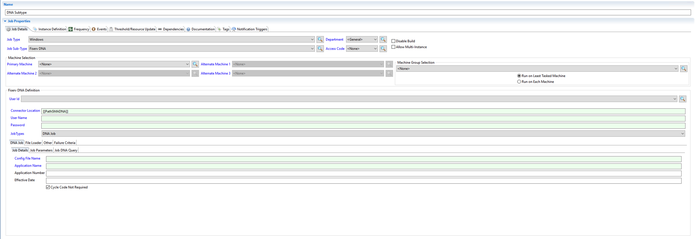

# SMA OpCon Fiserv DNA Subtype

After unzipping the Fiserv DNA Connector package perform the following steps to install the DNA Sub-type.

## Install the Sub-Type

1.  Within emplugins folder, locate the jar file called: ```com.sma.ui.core.jobdetails.fiservdna_.jar```.
2.  Copy the jar file from the DNA distribution directory, ```<media>:\SMADNAConnector\emplugins``` into ```<media>:\OpConxps\EnterpriseManager x64\dropins``` folder on each end-user's machine.

## Confirm the Sub-Type

To confirm that the sub-type is available for the end-user:

1.  Launch Enterprise Manager
2.  Create a new job with Windows for the Type
3.	Confirm that “Fiserv DNA” is in the job sub-type dropdown.
    

:::info NOTE
You may have to launch Enterprise Manager as Administrator the first time in order for the sub-type to show in the dropdown.
:::

:::info NOTE
For new implemntations, create a new Global Property with the path to SMARunDNAJob.exe as the value

Name: PathSMADNA

Value: ```<media>:\SMADNAConnector\```
:::

