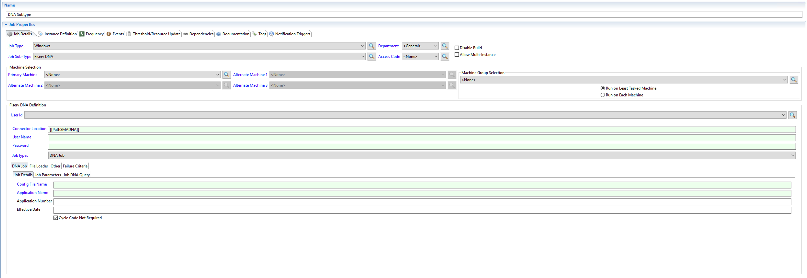

# Install the Fiserv DNA job sub-type

## What is it?

The Fiserv DNA job sub-type is a plug-in for Enterprise Manager that adds the DNA job definition form to OpCon's Windows job type. Install it on each machine where users define DNA jobs in Enterprise Manager.

## Prerequisites

- The Fiserv DNA Connector package is extracted and available.
- Enterprise Manager is installed on the target machine.

## Install the sub-type

To install the Fiserv DNA job sub-type, complete the following steps:

1. In the extracted connector package, open the `emplugins` folder.
2. Locate the file `com.sma.ui.core.jobdetails.fiservdna_<version>.jar`. The version and build stamp in the file name change with each release.
3. Copy the JAR file from `<media>:\SMADNAConnector\emplugins\` to `<media>:\OpConxps\EnterpriseManager x64\dropins\` on each machine running Enterprise Manager.

## Confirm the sub-type is available

To confirm that the sub-type is available, complete the following steps:

1. Open Enterprise Manager.
2. Create a new job with **Windows** as the job type.
3. Confirm that **Fiserv DNA** appears in the job sub-type list.

:::info NOTE
You may need to open Enterprise Manager as an administrator the first time for the sub-type to appear in the list.
:::

:::info NOTE
For new implementations, create two OpCon global properties. The job sub-type inserts both into every DNA job definition it creates, so a missing property leaves an unresolved token in the job definition and the job fails without indicating the cause.

| Name | Value | Used for |
|---|---|---|
| `PathSMADNA` | `<media>:\SMADNAConnector\` | The directory containing `SMARunDNAJob.exe`. |
| `PathSMADNAConfig` | The directory containing `SMARunDNAJob.ini` | The configuration file passed to `SMARunDNAJob.exe` with `-ConfigFile`. |

If the program and its configuration file are in the same directory, set both properties to that directory.
:::
