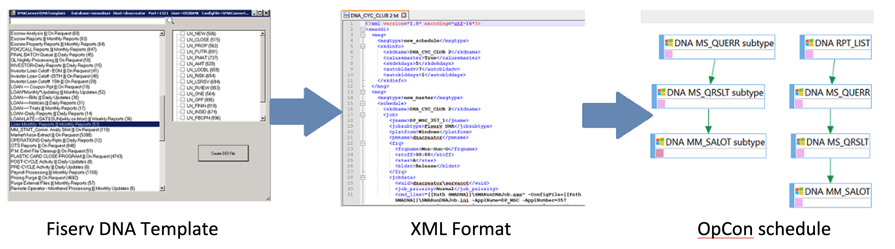

# Convert DNA Template program

## What is it?

The Convert DNA Template program (`SMAConvertDNATemplate.exe`) is a utility that imports existing Fiserv DNA templates (workflows) into OpCon as schedules and jobs. A Fiserv DNA implementation typically includes hundreds of existing templates containing APPLs (jobs). Rather than recreating each job manually in OpCon, SMAConvertDNATemplate extracts the template data from the Fiserv DNA Oracle database and converts it into an XML format that OpCon's DDI (Data Definition Interface) service can process.

OpCon's DDI service reads the XML from a hot folder and creates the schedules, jobs, and dependencies in the OpCon database automatically.

## How it works

1. SMAConvertDNATemplate connects to the Fiserv DNA Oracle database.
2. It extracts template information, including the APPLs (jobs) in each template and their dependencies.
3. It transforms the data into XML that OpCon's DDI service can read.
4. The DDI service picks up the XML file from its hot folder and creates the corresponding OpCon schedules, jobs, and job dependencies.

Once imported, the schedule structure, job definitions, and workflow dependencies are visible in OpCon and ready to run.

## FAQs

**Q: Do I need to use this program if I already have DNA jobs defined in OpCon?**

A: No. The Convert DNA Template program is for the initial migration from Fiserv DNA templates to OpCon. If your DNA jobs are already defined in OpCon, you do not need to use this program.

**Q: Can I run the conversion multiple times?**

A: Yes. Running the conversion again will generate a new XML file. The DDI service will re-import the jobs. Review existing OpCon schedules before re-importing to avoid duplicate job definitions.

**Q: Where is DDI's hot folder?**

A: The DDI hot folder path is configured in the OpCon server's DDI settings. Contact your OpCon administrator for the path.
