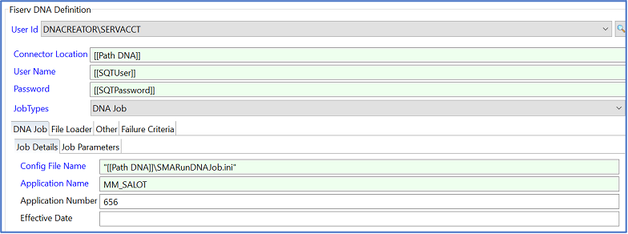
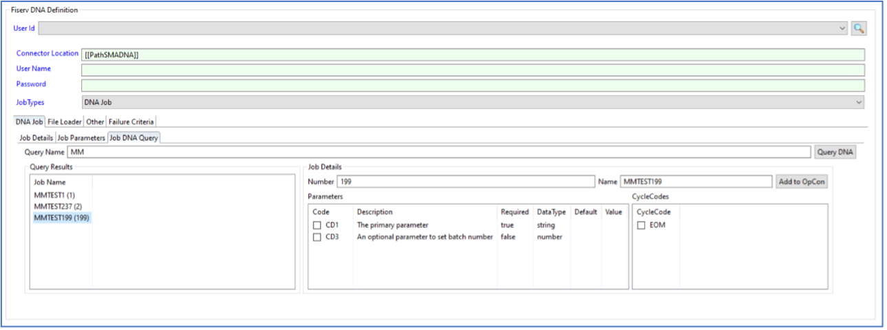

# Fiserv DNA job sub-type

## What is it?

The Fiserv DNA job sub-type is a job type embedded within OpCon's Enterprise Manager interface. It allows you to view, add, and edit DNA job details directly within OpCon without switching to a separate tool.

When you create a Windows job in OpCon and select **Fiserv DNA** as the sub-type, the job definition form displays DNA-specific fields organized across two tabs.

## Job definition tabs

### Job Details tab

The **Job Details** tab provides fields for the DNA job's core identifying information:

- **APPL name** — The name of the Fiserv DNA application (APPL) to run.
- **APPL number** — The numeric identifier for the Fiserv DNA application.
- **Effective date** — The processing date for the DNA job, in `YYYY/MM/DD` format.

Additional DNA-specific fields are available depending on the job type.

### Job DNA Query tab

The **Job DNA Query** tab lets you query the Fiserv DNA database directly from within OpCon to look up job definitions and auto-populate the job detail fields.

To use the query:

1. Select a template or APPL from the list.
2. Review the APPL details, including parameter codes, parameter code descriptions, data types, and default database values.
3. Select the parameters and cycle codes to include in the job.
4. Select **Add to OpCon** to auto-populate the selected values into the job definition.

## FAQs

**Q: Where is the Fiserv DNA sub-type installed?**

A: The sub-type is a plug-in for Enterprise Manager. Install it on each machine running Enterprise Manager. See [Install the Fiserv DNA sub-type](../installation/fiserv-dna-subtype.md) for instructions.

**Q: Why is the Fiserv DNA sub-type not visible in the job sub-type list?**

A: The sub-type may not be registered in the OpCon database. See [Troubleshooting tips](../reference/troubleshooting-tips.md) for the SQL script to add the sub-type record.
